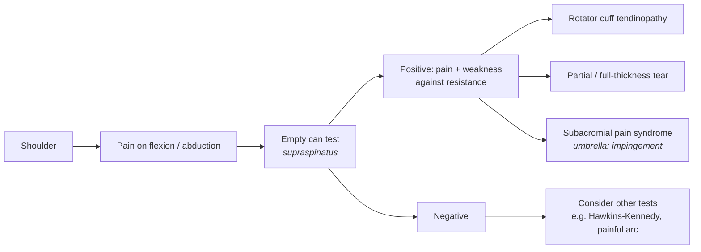

# PhysioTree 🦴

An interactive, editable mind map ("släktträd") of the physiotherapeutic assessment process. You start from a **body region**, pick a **symptom**, choose a **clinical test**, record whether the finding is **positive or negative**, and follow the branch to one or more **possible diagnoses**.

Every test has its own file with **sensitivity, specificity, likelihood ratios, sources** and a link to a demonstration video (primarily from [Physiotutors on YouTube](https://www.youtube.com/@Physiotutors)).

> ⚠️ **Educational tool for physiotherapy students.** It supports clinical reasoning practice. It is not a diagnostic tool and does not replace a full clinical assessment.

---

## How the tree works

Each level of the tree is one step in the clinical reasoning process:

```
Body region → Symptom → Test → Finding → Diagnosis
```

Example from the shoulder:



Note that it is really a **network** rather than a strict tree: the same test (e.g. Hawkins-Kennedy) can appear under several symptoms, and the same diagnosis can be reached from several tests. Tests and diagnoses are therefore stored once and *referenced* from the tree, so their data is only written in one place.

---

## Features

- 🌳 Interactive mind map — zoom, pan, expand/collapse branches
- 📄 One file per test with diagnostic accuracy data and sources
- ▶️ Video link on every test (Physiotutors)
- ✏️ Fully editable — the whole tree is plain text files you can edit in VS Code
- 🔍 Search for a test, symptom or diagnosis
- 🦴 Start with the shoulder, then add more regions (knee, hip, lumbar spine, ...)

---

## Project structure

```
physiotree/
├── content/
│   ├── regions/
│   │   └── shoulder.yaml        # The tree: symptoms → tests → findings → diagnoses
│   ├── tests/
│   │   ├── empty-can.md         # One file per test (accuracy data + video + how-to)
│   │   ├── hawkins-kennedy.md
│   │   └── ...
│   └── diagnoses/
│       ├── rotator-cuff-tendinopathy.md
│       └── ...
├── src/                         # The web app (React + React Flow)
├── templates/
│   ├── test-template.md
│   └── diagnosis-template.md
├── README.md
└── PLAN.md                      # Project plan and roadmap
```

---

## Editing the tree

You never need to touch the app code to change content.

**Add a new test:** copy `templates/test-template.md` into `content/tests/`, fill in the fields, then reference its `id` from a region file.

**Change the tree:** open `content/regions/shoulder.yaml` and add, move or delete branches. The app updates automatically when running locally.

Example test file (`content/tests/empty-can.md`):

```markdown
---
id: empty-can
name: Empty Can Test (Jobe's test)
region: shoulder
structure: Supraspinatus
sensitivity: null        # fill in, e.g. 0.69
specificity: null
lr_positive: null
lr_negative: null
source: ""               # e.g. meta-analysis reference
video: ""                # Physiotutors video URL
---

## How to perform
Arm in 90° scaption, internal rotation (thumbs down). Therapist applies downward resistance.

## Positive finding
Pain and/or weakness against resistance.

## Clinical notes
Pain alone is less specific than weakness. Combine with other tests.
```

Example branch in a region file (`content/regions/shoulder.yaml`):

```yaml
region: shoulder
symptoms:
  - id: pain-flexion-abduction
    label: Pain on flexion / abduction
    tests:
      - test: empty-can
        positive:
          finding: Pain and weakness against resistance
          diagnoses: [rotator-cuff-tendinopathy, rotator-cuff-tear, subacromial-pain-syndrome]
        negative:
          next_tests: [hawkins-kennedy, painful-arc]
```

---

## Getting started

```bash
git clone https://github.com/<your-username>/physiotree.git
cd physiotree
npm install
npm run dev
```

Open `http://localhost:5173` in your browser.

---

## Tech stack

- **Vite + React + TypeScript** — fast local development
- **React Flow** — interactive node/edge mind map
- **dagre** — automatic tree layout
- **YAML + Markdown with frontmatter** — content that is easy to read and edit
- **GitHub Pages** — free hosting straight from the repo

---

## Sources and accuracy data

All sensitivity/specificity values must have a cited source in the test file. Values vary between studies and populations, so prefer systematic reviews and meta-analyses and note the study population where relevant. Tests without verified data show "not yet sourced" in the app.

## License

TBD
